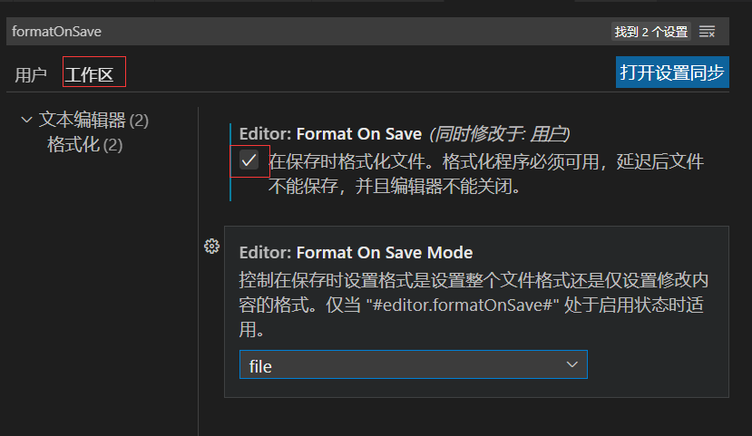
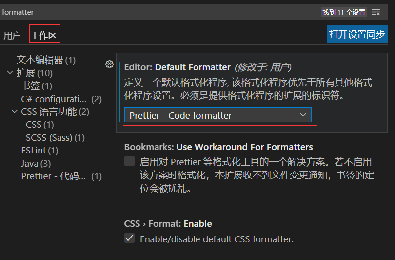

### 2-19 联合—Prettier +ESLint   结合

**Prettier  作用、特点**

Prettier  按照 ESLint 规则来格式化代码的工具，但 Prettier 有默认规则，也可以定义规则。当规则和 ESLint规则冲突时，Prettier会优先使用自己的规则。 特点：开箱即用。

**操作步骤：**

第一步：安装  Prettier - Code formatter。

第二步：settings 设置，勾选 Format On Save。




第三步：settings 设置，设置默认的格式化工具为 Prettier。



第四步： 使用 Prettier 来 按照 ESLint 规则来格式化代码。

```ts
{
  "semi": false, /* 不加分号*/
  "tabWidth": 2, /* 缩进2个空格*/
  "singleQuote": true,/* 单引号*/
  "printWidth":100
}
```

